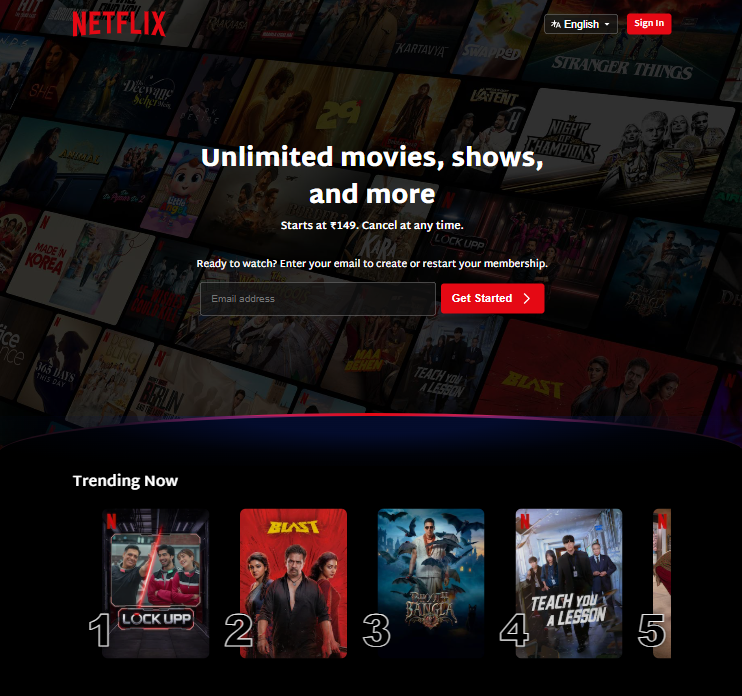

   # 🎬 Netflix Landing Page Clone
> A responsive front-end clone built for learning and practicing modern HTML and CSS.

A responsive clone of the Netflix India landing page built using **HTML5** and **CSS3**. This project was created to strengthen my front-end development skills by recreating the look and feel of the official landing page while focusing on responsive design, modern CSS techniques, and clean code organization.

## 🚀 Features

* Responsive design for desktop, tablet, and mobile devices
* Netflix-style hero section with dark overlay
* Custom curved divider using pure CSS
* Trending movies section
* "More Reasons to Join" cards
* Frequently Asked Questions section
* Footer similar to the original website
* Smooth hover effects and transitions
* SVG icons and custom assets

## 🛠️ Technologies Used

* HTML5
* CSS3
* Flexbox
* CSS Grid
* Media Queries
* SVG
* Google Fonts

---

## 📂 Project Structure

```
netflix-ui-clone/
│── index.html
│── style.css
│── README.md
│── assets/
│   ├── backgroundImage.jpg
│   ├── favicon.ico
│   ├── language.svg
|   ├── logo.svg
│   ├── dropdown.svg
|   ├── screenshot.png
│   ├── poster1.png
│   ├── ...
│   └── poster10.png

```

## 📸 Screenshot



---

## 💻 How to Run

1. Clone the repository.

```
git clone https://github.com/anantasangwan/netflix-ui-clone.git
```

2. Open the project folder.

3. Open `index.html` in your browser.

No additional setup is required.

---

## 📖 What I Learned

* Building responsive layouts using Flexbox and Grid
* Working with CSS gradients and overlays
* Creating reusable UI sections
* Using media queries for responsiveness
* Positioning elements with relative and absolute positioning
* Working with SVG icons
* Organizing project assets

---

## 📌 Future Improvements

- JavaScript functionality for the FAQ section
- Dark/Light theme toggle
- Better accessibility
- Keyboard navigation support

---

## ⚠️ Disclaimer

This project was created for educational purposes only. It is inspired by the Netflix landing page and is not affiliated with, endorsed by, or associated with Netflix.

---

## 👤 Author

**Ananta Sangwan**

GitHub: https://github.com/anantasangwan
